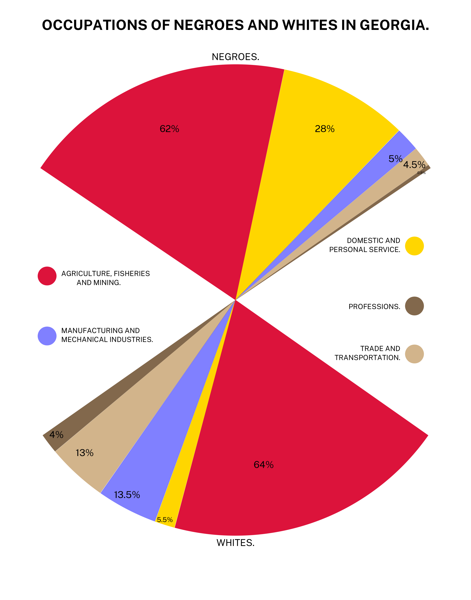

```{r setup, include=FALSE}
knitr::opts_chunk$set(echo = TRUE)
library(tidyverse)
library(readxl)
```

## Recreate the Du Bois data portrait using bar charts



1.  Build a data frame containing the data for this exercise.

```{r}
# Make a data frame for the occupation visualization
occup <- tribble(
  ~sector         , ~race   , ~pct ,
  "Agriculture"   , "black" , 62   ,
  "Agriculture"   , "white" , 64   ,
  "Domestic"      , "black" , 28   ,
  "Domestic"      , "white" , 5.5  ,
  "Manufacturing" , "black" , 5    ,
  "Manufacturing" , "white" , 13.5 ,
  "Trade/Trans"   , "black" , 4.5  ,
  "Trade/Trans"   , "white" , 13   ,
  "Professions"   , "black" , 0.5  ,
  "Professions"   , "white" , 4
)


```

2.  Use an appropriate geom to make at least two different bar charts to visualize these data. Consider different choices for the x variable, and different choices of position.

```{r}
ggplot(occup)

```

## Read in Chetty data (with a twist)

```{r}
chetty <- read_excel("Lab1_Chetty_2014.xlsx", skip=1)
# The following code converts the variable top_100 from continuous to categorical
chetty <- chetty %>%
  mutate(top_100 = as.factor(top_100))
```

3.  Which variables in the chetty data frame are appropriate x variables for a bar chart?

4.  Make two separate bar charts for two different x variables.

5.  Make two more bar charts that display proportions rather than counts of those same variables.

```{r}
#4 
# bar chart 1
ggplot(chetty)

# bar chart 2
ggplot(chetty)

#5 
# bar chart 1
ggplot(chetty)

# bar chart 2
ggplot(chetty)


```

6.  Make a bar chart that lets you compare the number of urban and rural CZ's in each of the four regions.

7.  Make a bar chart that lets you compare the total number of CZ's in each of the four regions, including the proporation that are urban and rural.

8.  Make another bar chart that lets you easily compare the proportions of urban CZs across the four regions.

```{r}
#6 
ggplot(chetty)

#7 
ggplot(chetty)

#8 
ggplot(chetty)

```

9.  Discuss the pros and cons of each visualization you created.
