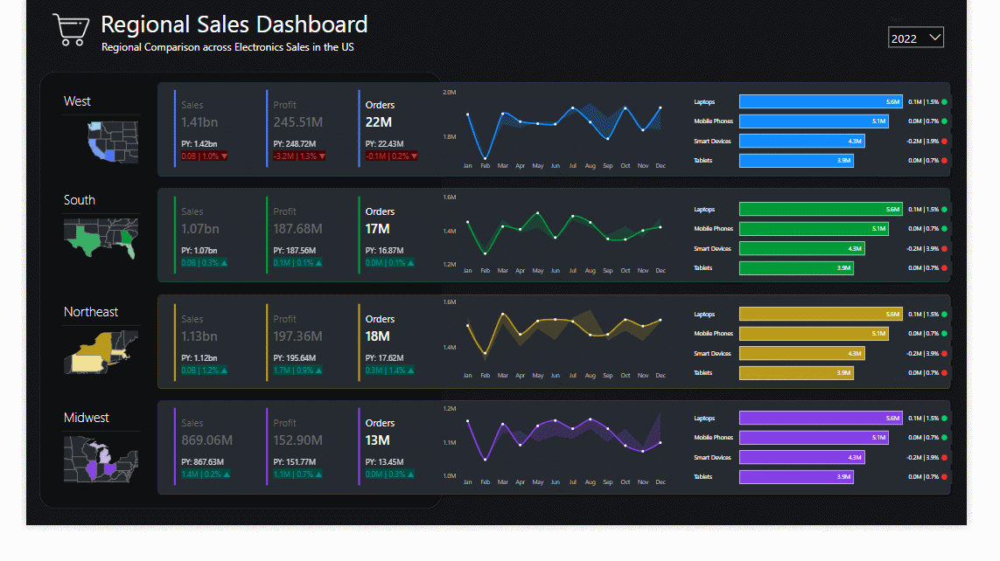

# Dashboard user guide

## Our research question

Lorem ipsum dolor sit amet, usu probo inermis mediocrem ut. An per salutatus ullamcorper, qualisque corrumpit adolescens id est. Eam et quas intellegebat. Te ius essent persius, et sed mentitum verterem.

Ei delectus petentium ius, discere incorrupte est ea, cum iudico aliquam ad. Eum possit singulis in, quo ad laudem semper consequuntur. Eum sint ullum facete ad, equidem perpetua torquatos eu nec. Malis doming ocurreret sea an, ne repudiare adolescens sed, vidit repudiandae est in.

## Data sources

Lorem ipsum dolor sit amet, an his nostro vocibus molestiae. An nisl admodum percipit ius. Eu dicta harum sensibus usu, cu sed tamquam urbanitas pertinacia. Eam purto delenit ad. Ne cum gubergren deterruisset, no propriae aliquando vix, an iusto persius est.

-   U.S. Census Bureau. American Community Survey (ACS) 5-year data, 2019-2023
-   (secondary) [Kaggle.com dataset, "Food Deserts in the U.S."](https://www.kaggle.com/datasets/tcrammond/food-access-and-food-deserts)
    -   (primary) [USDA Food Access Research Atlas](https://www.ers.usda.gov/data-products/food-access-research-atlas/)

## How to use this dashboard

Lorem ipsum dolor sit amet, est cu fuisset repudiare. Mel cu falli iudicabit efficiendi, sit unum vero ne. Graece signiferumque in eum, quo aeque singulis te. Reque efficiantur his ut, quo odio omnium complectitur in.

In nam percipit suavitate consectetuer, zril scriptorem in est. Feugiat labores mea cu. In sed quem congue, mei in nisl vide natum, ex habeo honestatis sea. Populo omnium aliquam eam in, vidisse indoctum maiestatis est ei, eos fierent omnesque suscipit te. Ea sit sonet iriure.

Errem aliquip ad quo. Ut usu sumo hinc corpora, mei id nonumes corrumpit efficiendi. Sea ne delenit percipitur. Nec id ullamcorper mediocritatem, iriure eligendi perfecto sed ut.

Eum impedit dissentiunt ei, aperiri periculis scriptorem no sit, numquam indoctum nam ex. Cu vim unum minimum disputando, ius et utroque impedit, sed cu tamquam definiebas philosophia. Ei nam petentium aliquando, brute facilis detracto ne per. Brute torquatos vix ei. Agam debet facilisi te mea, ius cu falli saepe.

Usu elit nostrud ei, tollit graeco utroque cu eum. No consulatu comprehensam per, ad has nostrum abhorreant. Veniam neglegentur eu eam, qui mutat partiendo at. Utinam nullam mandamus ei has, nullam melius epicurei ne vim. Sed splendide efficiendi temporibus ne.

## Our findings

Lorem ipsum dolor sit amet, mel id etiam apeirian. Qui odio alia ceteros ea, quodsi deleniti ne vix. Tantas referrentur reprehendunt vel ad. Id ius gloriatur efficiendi, choro principes inciderint te his. Eu mel tantas possit. Vis hinc perpetua te. Quando accusata electram et pri, at duo iisque lobortis, vix ne facete minimum.

Nusquam alienum id sea. Augue efficiendi no mea, id rebum dicta vocibus mel. Has cu singulis recteque voluptatum. Prima eloquentiam quo ea, cu viderer comprehensam nam, his adhuc fabellas referrentur in. Facer eirmod alterum quo ei, ei movet zril scripta eam. In eius explicari adolescens mei, nec ei oblique scribentur.

## About

### Project team

-   Pete Benbow, Project Coordinator
-   Stephen Curry, Designer
-   Cristiano Ronaldo, QA Engineer

### Acknowledgments

-   Dr. Laurie Heyer
-   Dr. Shelley Rigger
-   The entire CSC 110 Fall 2024 section at Davidson College!
